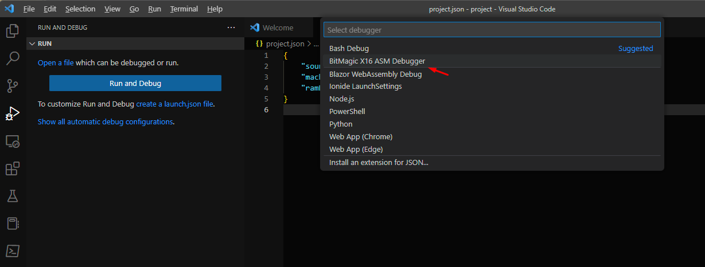
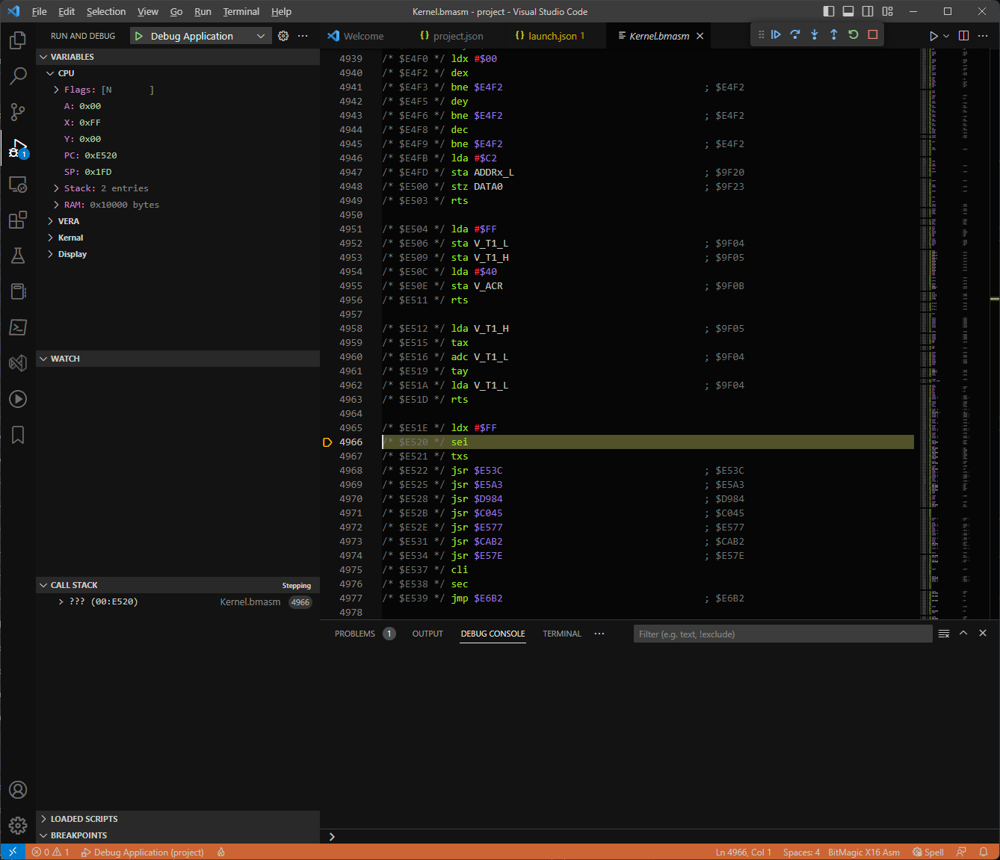
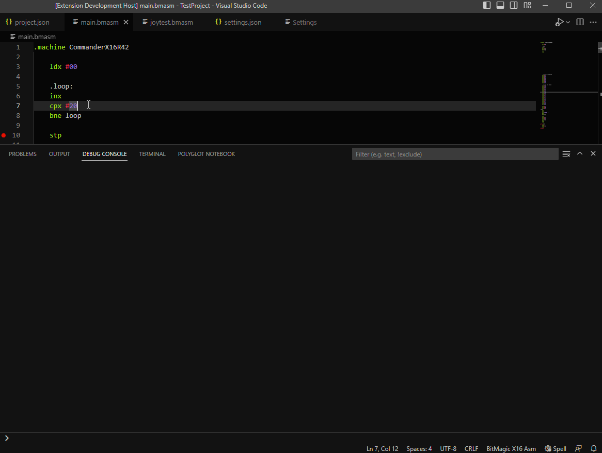

# BitMagic - The Debugger

[](https://github.com/Yazwh0/BitMagic/actions/workflows/build-test.yml)

The debugger is an application that supports [DAP](https://microsoft.github.io/debug-adapter-protocol/overview) to allows developers to use applications such as VSCode to develop applications for the Commander X16.

Currently only Windows is supported. In theory this could run on any x64 system which dotnet can target, but without the ability to test on these machines I cannot offer support to them currently.

## Installation

You can obtain the VSCode extension from the extensions market place. Simply search for `BitMagic` and click install.

For legal reasons, you will need to obtain your own copy of the [Rom](/Rom).

## Getting Started

The easiest way to get something working is to create a `project.json` file as follows:

```json
{
    "source": "",
    "emulatorDirectory" : "c:\\x16emu"
}
```

Then, go to the debug and run screen, click on `create a launch file`, and then on `BitMagic X16 ASM Debugger`.



This will create a `launch.json`. Hit `F5` to run, and type `project.json`. A emulator window should then appear and VSCode should give you an interactive debugging session.

If you don't want to enter the filename of what to debug each time, change the `program` entry in `project.json` by replacing `${command:AskForProgramName}` with the initial filename.



## Watches and Breakpoints

BitMagic has support for conditional breakpoints, log points, hit count breakpoints and extensive Watches.

Please see the [Watches and Breakpoints](Debugger/WatchesBreakpoints) page for more information.



## Kernel Symbols

The best way to run the debugger is with Kernel symbols.

By setting the `EmulatorDirectory` to the folder containing the official emulator, the symbols will be set up automatically.

If you want to run a custom ROM, then the symbols are overridable via the `project.json`.

## Project File

While its possible to start debug a `.bmasm` file directly, it is better to use a project file. This is a `.json` file that defines how the debugger sets up the system for you're requirements.

The schema is below:

```c#
public class X16DebugProject
{
    /// <summary>
    /// Start the application in stepping mode.
    /// </summary>
    [JsonProperty("startStepping", DefaultValueHandling = DefaultValueHandling.Ignore)]
    public bool StartStepping { get; set; } = true;

    /// <summary>
    /// Main source file.
    /// </summary>
    [JsonProperty("source", DefaultValueHandling = DefaultValueHandling.Ignore)]
    public string Source { get; set; } = "";

    /// <summary>
    /// Directly run the compiled code, or if false compile the source and add it as a file to the SDCard.
    /// </summary>
    public bool DirectRun { get; set; } = false;

    /// <summary>
    /// Run the main application by creating a AUTOBOOT.X16 file. This will not overwrite if the file already exists.
    /// </summary>
    public bool AutobootRun { get; set; } = true;

    /// <summary>
    /// Location to save the .prg and other files from the source file on the host. (Not on the sdcard.)
    /// </summary>
    public string OutputFolder { get; set; } = "";

    /// <summary>
    /// Start address. If omitted or -1, will start the ROM normally from the vector at $fffc.
    /// </summary>
    [JsonProperty("startAddress", DefaultValueHandling = DefaultValueHandling.Ignore)]
    public int StartAddress { get; set; } = -1;

    /// <summary>
    /// ROM file to use.
    /// </summary>
    [JsonProperty("romFile", DefaultValueHandling = DefaultValueHandling.Ignore)]
    public string RomFile { get; set; } = "";

    /// <summary>
    /// Folder for the official X16 Emulator.
    /// The rom.bin file from this directory will be used if not set by RomFile.
    /// Symbols for the ROM banks will also be loaded from here, using the names from RomBankNames + .sym extension.
    /// </summary>
    [JsonProperty("emulatorDirectory", DefaultValueHandling = DefaultValueHandling.Ignore)]
    public string EmulatorDirectory { get; set; } = "";

    /// <summary>
    /// List of files that can be imported for symbols.
    /// </summary>
    [JsonProperty("symbols", DefaultValueHandling = DefaultValueHandling.Ignore)]
    public SymbolsFile[] Symbols { get; set; } = Array.Empty<SymbolsFile>();

    /// <summary>
    /// Display names for the Rom banks.
    /// </summary>
    [JsonProperty("romBankNames", DefaultValueHandling = DefaultValueHandling.Ignore)]
    public string[] RomBankNames { get; set; } = new string[] { "Kernal", "Keymap", "Dos", "Fat32", "Basic", "Monitor", "Charset", "Codex", "Graph", "Demo", "Audio", "Util", "Bannex", "X16Edit1", "X16Edit2" };

    /// <summary>
    /// Display names for the Ram banks.
    /// </summary>
    [JsonProperty("ramBankNames", DefaultValueHandling = DefaultValueHandling.Ignore)]
    public string[] RamBankNames { get; set; } = Array.Empty<string>();

    /// <summary>
    /// Machine to load globals from if there is no bmasm source.
    /// </summary>
    [JsonProperty("machine", DefaultValueHandling = DefaultValueHandling.Ignore)]
    public string Machine { get; set; } = "";

    /// <summary>
    /// Prefill the keyboard buffer with this data. 16bytes max, rest are discarded.
    /// </summary>
    [JsonProperty("keyboardBuffer", DefaultValueHandling = DefaultValueHandling.Ignore)]
    public byte[] KeyboardBuffer { get; set; } = new byte[] { };

    /// <summary>
    /// Prefill the mouse buffer with this data. 8bytes max, rest are discarded.
    /// </summary>
    [JsonProperty("mouseBuffer", DefaultValueHandling = DefaultValueHandling.Ignore)]
    public byte[] MouseBuffer { get; set; } = new byte[] { };

    /// <summary>
    /// RTC NvRam Data
    /// </summary>
    [JsonProperty("nvRam", DefaultValueHandling = DefaultValueHandling.Ignore)]
    public RtcNvram NvRam { get; set; } = new RtcNvram();

    /// <summary>
    /// Files to add to the root directory of the SDCard. Wildcards accepted.
    /// </summary>
    [JsonProperty("sdCardFiles", DefaultValueHandling = DefaultValueHandling.Ignore)]
    public string[] SdCardFiles { get; set; } = new string[] { };

    /// <summary>
    /// Capture changes between every time the emulator is paused. (Eg breakpoints or stepping)
    /// </summary>
    [JsonProperty("captureChanges", DefaultValueHandling = DefaultValueHandling.Ignore)]
    public bool CaptureChanges { get; set; } = false;

    /// <summary>
    /// Cartridge file to load
    /// </summary>
    [JsonProperty("cartridge", DefaultValueHandling = DefaultValueHandling.Ignore)]
    public string Cartridge { get; set; } = "";

    /// <summary>
    /// Display Segments
    /// </summary>
    [JsonProperty("compileOptions", DefaultValueHandling = DefaultValueHandling.Ignore)]
    public CompileOptions? CompileOptions { get; set; } = null;

    /// <summary>
    /// Value to fill CPU RAM and VRAM with at startup.
    /// </summary>
    [JsonProperty("memoryFillValue", DefaultValueHandling = DefaultValueHandling.Ignore)]
    public byte MemoryFillValue { get; set; } = 0;

    /// <summary>
    /// Base Path, should try to use this for all other paths
    /// </summary>
    [JsonProperty("basePath", DefaultValueHandling = DefaultValueHandling.Ignore)]
    public string BasePath { get; set; } = "";
}

public class RtcNvram
{
    /// <summary>
    /// Filename to load into 0x00 -> 0x60 in the RTCs NVRAM.
    /// Not used if Data has values.
    /// </summary>
    public string File { get; set; } = "";

    /// <summary>
    /// Data to load into 0x00 -> 0x60 in the RTCs NVRAM.
    /// </summary>
    public byte[] Data { get; set; } = new byte[] { };

    /// <summary>
    /// Filename to store the RTCs NVRAM in. This will overwrite.
    /// </summary>
    public string WriteFile { get; set; } = "";
}

public class SymbolsFile
{
    /// <summary>
    /// File name.
    /// </summary>
    [JsonProperty("name", DefaultValueHandling = DefaultValueHandling.Ignore, Required = Required.Always)]
    public string Name { get; set; } = "";

    /// <summary>
    /// ROM bank that the symbols are for. Omit or not a rombank file. Any symbols in the ROM area will be discarded.
    /// </summary>
    [JsonProperty("romBank", DefaultValueHandling = DefaultValueHandling.Ignore)]
    public int? RomBank { get; set; }

    /// <summary>
    /// RAM bank that the symbols are for. Omit for not a rambank file. Any symbols in the RAM area will be discarded.
    /// </summary>
    [JsonProperty("ramBank", DefaultValueHandling = DefaultValueHandling.Ignore)]
    public int? RamBank { get; set; }

    /// <summary>
    /// Range of memory that is a jump table. Used to create extra symbols.
    /// </summary>
    public RangeDefinition[] RangeDefinitions { get; set; } = Array.Empty<RangeDefinition>();
}

public class RangeDefinition
{
    /// <summary>
    /// Start address of the jump table
    /// </summary>
    public string Start { get; set; } = "";

    /// <summary>
    /// End address of the jump table
    /// </summary>
    public string End { get; set; } = "";

    /// <summary>
    /// Type of definition, supported : 'jumptable'
    /// </summary>
    public string Type { get; set; } = "jumptable";
}
```

## Upcoming Features

The following features are not yet implemented but are planned to be:

- Breakpoints on data changes. (Need to explore how we'd do this with DAP.)
- Cartridge support. [Issue](hhttps://github.com/Yazwh0/BitMagic/issues/1)
