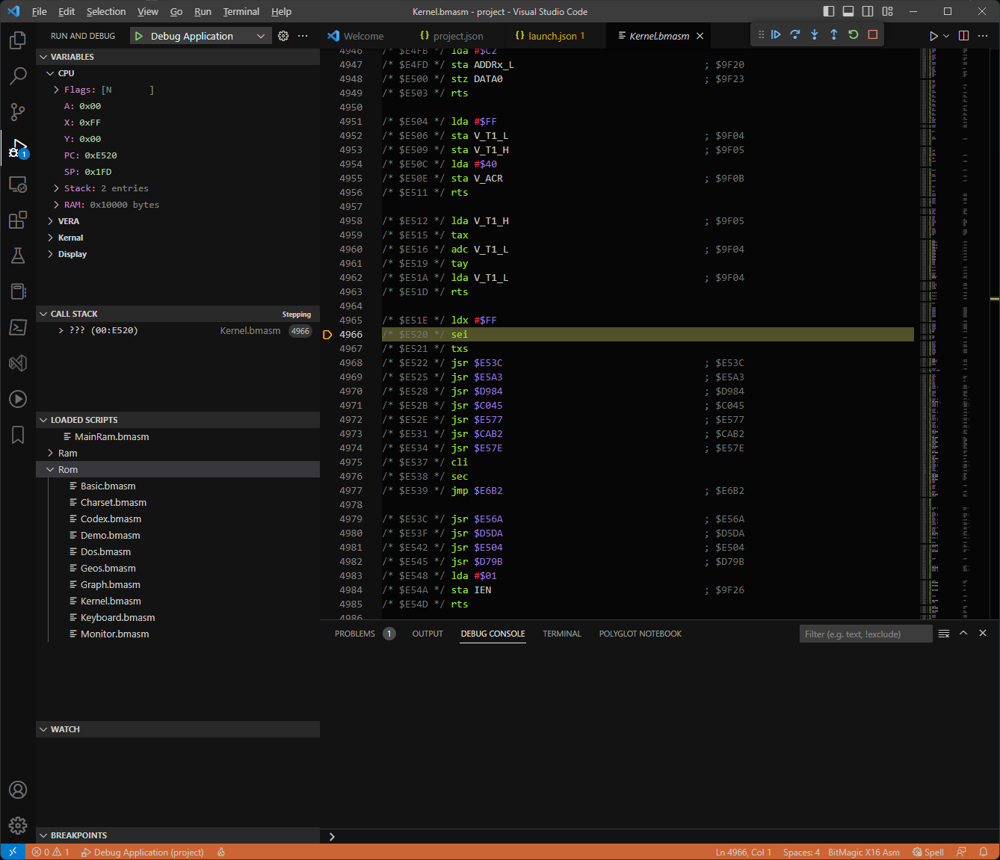

# BitMagic - The Debugger

[](https://github.com/Yazwh0/BitMagic/actions/workflows/build-test.yml)

The debugger is an application that supports [DAP](https://microsoft.github.io/debug-adapter-protocol/overview) to allows developers to use applications such as VSCode to develop applications for the Commander X16.

## Installation

As the VSCode extension is not yet published, the steps are a little more complex than they will eventually be.

Download the Debugger from the latest build action on [Github](https://github.com/Yazwh0/BitMagic/actions).

Obtain a copy of the [Rom](Rom.md).

Clone the [VSC Extension](https://github.com/Yazwh0/BitMagic.VSC) project.

At this point you can either open the VSC Extension within VSCode and run it. It will spawn another VSCode instance in which you can try out the debugger. Or run the batch app `create_extension.bat` which will build and install the `.vsix` to your copy of VSCode.

## Getting Started

Currently the debugger only works via TCP/IP, so it needs to be started manually. This will change in later version, but it helps with debugging the debugger.

To do this use:

`x16d --port 2563`

We now need a project to run. Open VSCode in an empty folder.

Create a `project.json` file as follows:

```json
{
    "source": "",
    "machine" : "CommanderX16R42",
    "ramBankNames" : [ "Kernel_Ram" ]
}
```

Then, go to the debug and run screen, click on `create a launch file`, and then on `BitMagic X16 ASM Debugger`.


This will create a `launch.json`. Hit `F5` to run, and type `project.json`. A emulator window should then appear and VSCode should give you an interactive debugging session.

If you don't want to enter the filename of what to debug each time, change the `program` entry in `project.json` by replacing `${command:AskForProgramName}` with the initial filename.



## Kernel Symbols

The best way to run the debugger is with Kernel symbols. To do this, you'll need to get hold of them but they should be included with whichever means you've obtained the Rom.

If the symbols are in `c:\Documents\Source\x16-rom\build\x16`, then you can replace your `project.json` with the follow which will decorate the disassembled code with symbols, making Rom debugging much easier!

```json
{
    "source": "",
    "machine" : "CommanderX16R42",
    "ramBankNames" : [ "Kernel_Ram" ],
    "romFile" : "C:\\Documents\\Source\\x16-rom\\build\\x16\\rom.bin",
    "symbols": [
        {
            "name": "C:\\Documents\\Source\\x16-rom\\build\\x16\\kernal.sym",
            "romBank": 0,
            "RangeDefinitions" : [
                {
                    "type" : "jumpTable",
                    "Start" : "0xFEBD",
                    "End" : "0xFF80"                    
                },                
                {
                    "Start" : "0xFF81",
                    "End" : "0xFFF6"
                }
            ]
        },
        {
            "name": "C:\\Documents\\Source\\x16-rom\\build\\x16\\keymap.sym",
            "romBank": 1
        },
        {
            "name": "C:\\Documents\\Source\\x16-rom\\build\\x16\\dos.sym",
            "romBank": 2,
            "RangeDefinitions" : [
                {
                    "type" : "jumpTable",
                    "Start" : "0xc000",
                    "End" : "0xc036"
                }
            ]
        },
        {
            "name": "C:\\Documents\\Source\\x16-rom\\build\\x16\\geos.sym",
            "romBank": 3
        },
        {
            "name": "C:\\Documents\\Source\\x16-rom\\build\\x16\\basic.sym",
            "romBank": 4
        },
        {
            "name": "C:\\Documents\\Source\\x16-rom\\build\\x16\\monitor.sym",
            "romBank": 5
        },
        {
            "name": "C:\\Documents\\Source\\x16-rom\\build\\x16\\charset.sym",
            "romBank": 6
        },
        {
            "name": "C:\\Documents\\Source\\x16-rom\\build\\x16\\codex.sym",
            "romBank": 7
        },
        {
            "name": "C:\\Documents\\Source\\x16-rom\\build\\x16\\graph.sym",
            "romBank": 8
        },
        {
            "name": "C:\\Documents\\Source\\x16-rom\\build\\x16\\audio.sym",
            "romBank": 10
        }
    ]
}
```


## Upcoming Features

The following features are not yet implemented but are planned to be:

- Use StdIn\Out so an instance doesn't need to be running.
- File system hooks so the a `.prg` can be loaded via the kernel and debugged as you'd expect.
- Improved SDCard support inline with the Emulator.
- Step Out.
- Watches.
- Breakpoints on data changes.
- Conditional Breakpoints.
- Template Engine support.
- Cartridge support.
