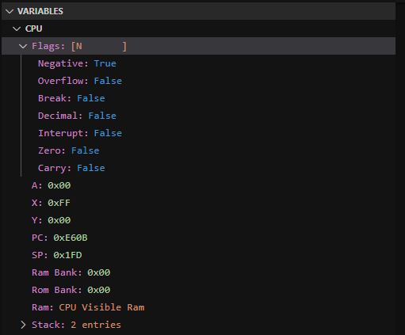
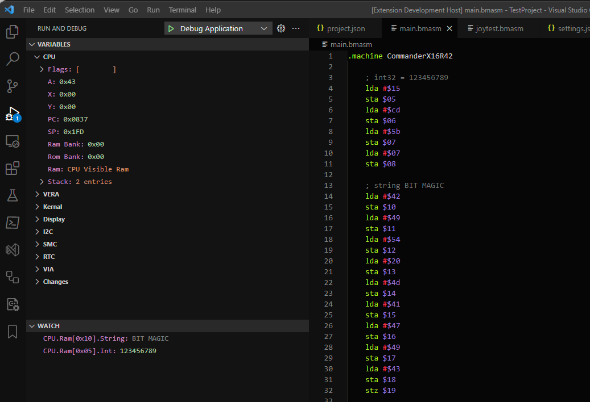
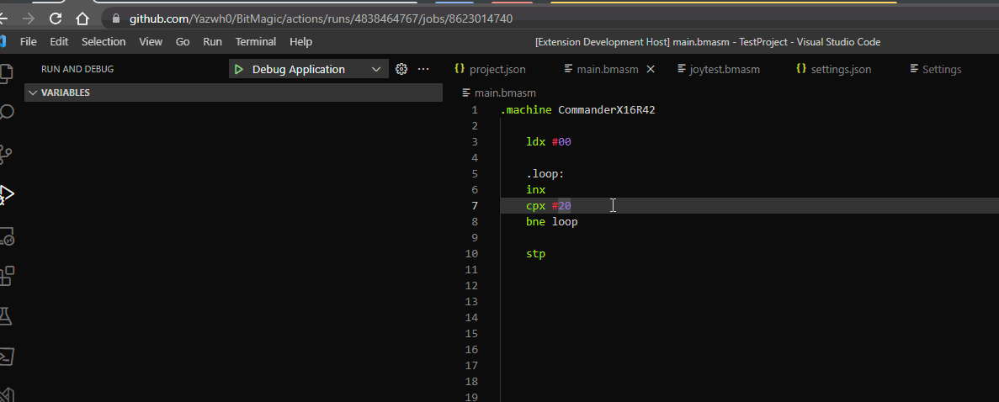

# Watches and Breakpoints

**Please note the documentation is a currently a work in progress while the old docs are brought up to date.**

Expressions are used while debugging to show the state of the machine in the Watch window, to set [conditional and hit-count breakpoints](https://code.visualstudio.com/docs/editor/debugging#_conditional-breakpoints), along with setting [logpoints](https://code.visualstudio.com/docs/editor/debugging#_logpoints).

The expressions are generally C# format, and are based on the variables shown in the debugger.

Because expressions are C# code, they are case sensitive.

For example the CPU's registers and flags are available as:

```text
CPU.A
CPU.X
CPU.Y
CPU.Flags.Zero
CPU.Flags.Carry
```

Which matches up to the Variables widow:



Memory can be queried as an array. For example to read a single byte:

```
CPU.Ram[0x0000]
VERA.VRam[0x00000]
```

Arrays have additional functionality to allow us to see a value at a position as if it were other data types.

```c#
CPU.Ram[0x0000].Byte                // 8 bit integer
CPU.Ram[0x0000].Sbyte               // Signed 8 bit integer
CPU.Ram[0x0000].Char                // Character
CPU.Ram[0x0000].Short               // 16 bit integer
CPU.Ram[0x0000].Ushort              // Signed 16 bit integer
CPU.Ram[0x0000].Int                 // 32 bit integer
CPU.Ram[0x0000].Uint                // Signed 32 bit integer
CPU.Ram[0x0000].Long                // 64 bit integer
CPU.Ram[0x0000].Ulong               // Signed 64 bit integer
CPU.Ram[0x0000].String              // Null terminated string
CPU.Ram[0x0000].FixedString(10)     // Fixed length string
```

For example the Watch window showing an 32 bit integer and a string:



As this is a C# expression, the offset doesn't need to be a constant, but can be an expression. These are all valid:

```c#
CPU.Ram[CPU.X]
CPU.Ram[CPU.Y * 2 + 100]
CPU.VRam[CPU.X * CPU.Y]
```

## Conditional Breakpoints

Conditional breakpoints will evaluate the expression and check if the result is 'truthy'. The breakpoint is considered hit if the value is `true`, non-zero or a non-blank string.


## Hit Count Breakpoints

Hit count breakpoints work like conditional breakpoints, but the number of times a breakpoint has been hit is added to the beginning of the expression.

For example a hit count breakpoint of `== 10` would become `x == 10`, where x is an integer. Again the truthy value rules are applied.

Hit count breakpoints can be combined with conditional breakpoints for extra flexibility, however both need to be true for the breakpoint to hit.



## Logpoints

Logpoints will display a message in the output window when they are hit, which is especially useful for a system where outputting text natively is difficult.

Logpoints can be combined with conditional and hit count breakpoints to determine if the output will be logged.

The string is a C# formatted string, and can bring in the system variables like any other expression.


## Performance

Its worth noting that performance of breakpoints that have an expression attached is poor, as the execution of the X16 has to be suspended with the display being updated to evaluate the breakpoint. As such you should try to use them sparingly, and disable breakpoints when not in use.
